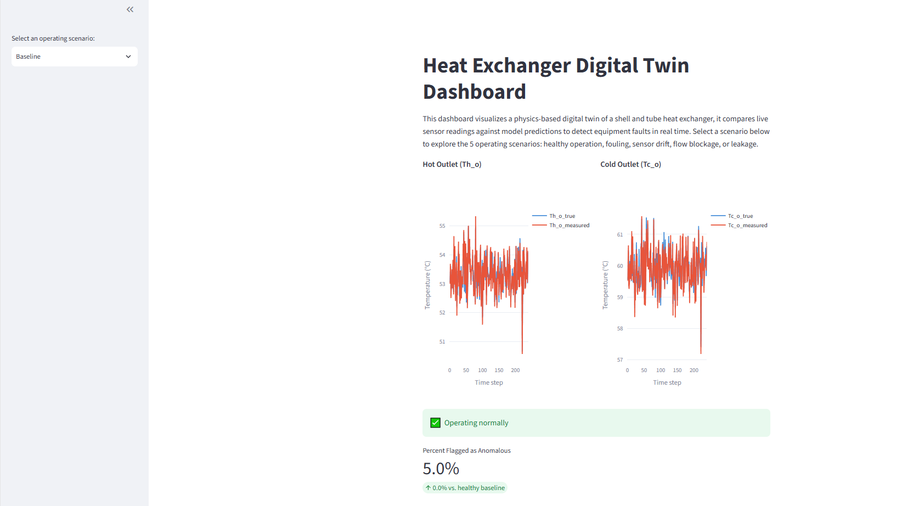
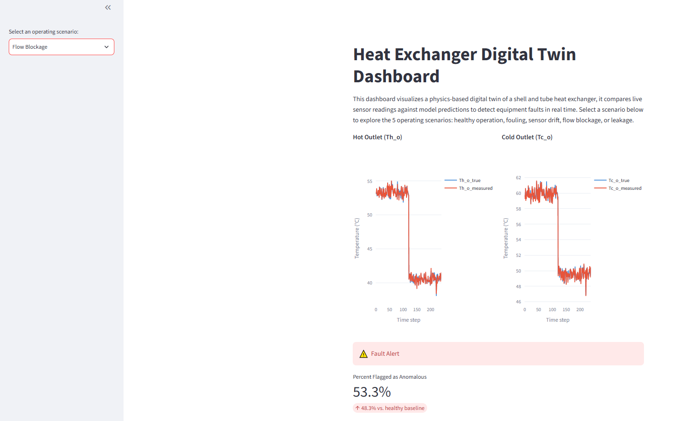
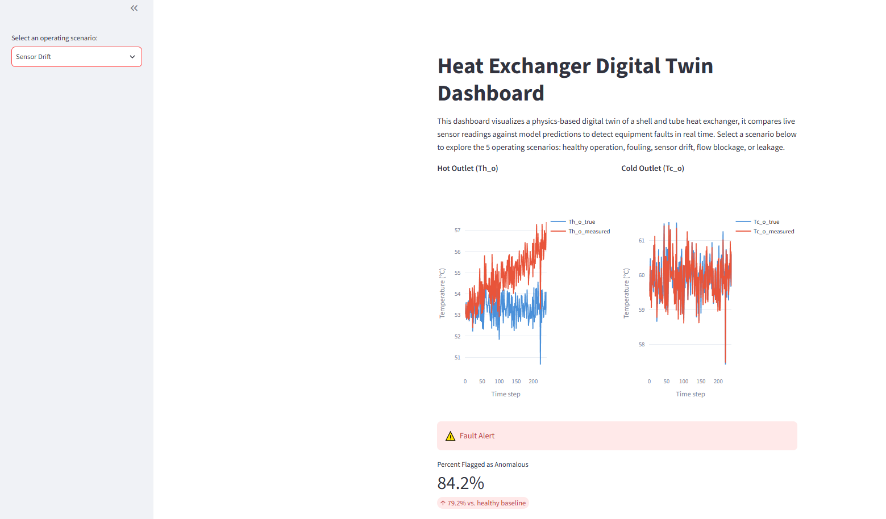
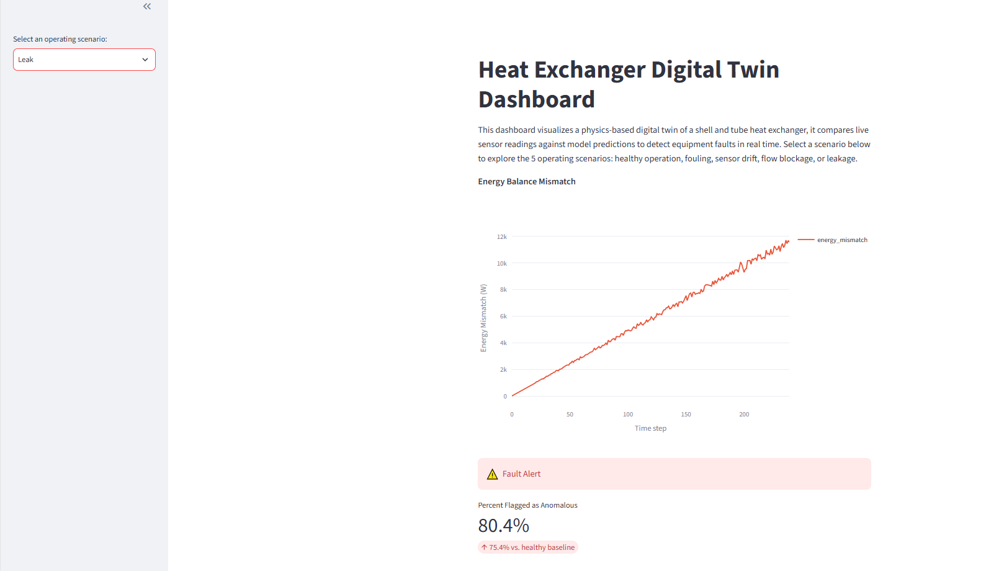

# Heat Exchanger Digital Twin

**By Grayson Kelly | Chemical Engineering & Data Science @ Western University**

[LinkedIn](www.linkedin.com/in/grayson-d-kelly) | [GitHub](https://github.com/grayson-kelly)

A physics-based digital twin for shell-and-tube heat exchanger fault detection that combines process modeling with automated fault detection and a streamlit dashboard

## Overview

My project simulates a shell-and-tube heat exchanger using the effectiveness-NTU method. I developed and calculated a first-principles model of the heat transfer between a cold and hot stream of water. All of the physics was hand derived and validated against an energy balance and thermodynamic constraints before being implemented into the project.

Synthetic sensor data was generated to represent healthy baseline operation and four realistic fault scenarios including fouling (a decreasing heat transfer coefficient [U]), sensor drift (slowly biased temperature readings), blockage (sudden drop in mass flow rate), and leakage (gradually increasing mass and energy balance difference). Each fault was validated against the expected physical behavior before I used it for detection.

A residual-based fault detection pipeline compares the live sensor readings against the physics model's predictions. An Isolation Forest was trained only on healthy operating data to automatically flag faulty operation conditions.

All of this was made into an interactive dashboard using Streamlit, which allows for a live comparison of predicted vs measured performance and presents fault alerts in real time.

I built this project to tie both Chemical Engineering and Data Science together. I combined process modeling with the kind of data pipelines, fault detection, and visualization tools used in industrial process monitoring. This is a working example of the exact skill combination I'm aiming to bring to co-op and industry roles.

## Features

- **Physics-Based Digital Twin** - An effectiveness-NTU model of a 1 shell pass, 2 tube pass shell-and-tube heat exchanger, hand-derived and checked against energy balance and thermodynamic constraints.

- **Synthetic Sensor Data Generation** - Simulated 4 hours of 1 minute sensor readings representing healthy operation, and realistic sensor noise was layered on top of the model's predictions.

- **Fault Injection** - Four fault scenarios were created: fouling, sensor drift, flow blockage, and leakage. Each of the faults were validated against expected physical behavior.

- **Residual-Based Fault Detection** - Residuals were standardized and fed into an Isolation Forest that was trained exclusively on baseline data, automatically flagging anomalous operation conditions.

- **Interactive Streamlit Dashboard** - Live comparison of measured vs. predicted performance for the selected scenario, with real-time fault alerts and an anomaly percentage metric.

## Screenshots

### Baseline Operation


### Flow Blockage


### Sensor Drift


### Leak


## Tech Stack

- **Python** - core language used

- **NumPy & pandas** - for data generation, manipulation, and analysis

- **scikit-learn** - StandardScalar and IsolationForest

- **Streamlit** - interactive dashboard

- **Plotly** - dashboard data plots/visualization

- **Matplotlib** - validation plots to check physical model

- **Jupyter Notebook** - model development, data generation, analysis

## Project Structure

```
heat-exchanger-digital-twin/
├── app/
│   └── dashboard.py           # Streamlit dashboard
├── data/                       # Generated CSVs (baseline + 4 fault scenarios)
├── notebooks/
│   ├── 01_model_validation.ipynb
│   ├── 02_data_generation.ipynb
│   ├── 03_fault_injection.ipynb
│   └── 04_fault_detection.ipynb
├── src/
│   └── heatexchanger_model.py  # Validated effectiveness-NTU physics model
├── assets/                     # README screenshots
├── requirements.txt
└── README.md
```